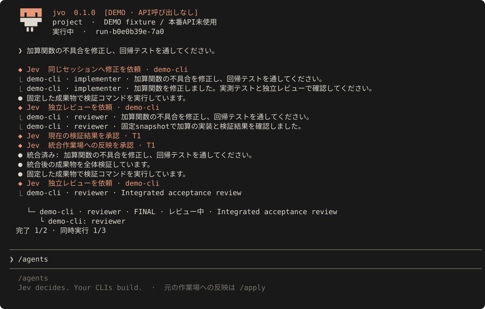

# Jev Orchestrator

**Jev decides. Your CLIs build.**

`jvo` は、Jevを**判断専用**の仲介役として、インストール済みの **Codex / Claude Code / Pi / OpenCode** を連携するローカルオーケストレーターです。OpenClaudeを参考にした会話中心のTUIで、エージェントの進捗、差分、判断記録、使用量を確認できます。



Jevはコードや計画文を生成しません。難易度、担当、計画の採否、追加調査、レビュー、差し戻し、統合、完了承認を型付きの選択として返します。実作業は既存CLIが行い、ローカルの実行コアが証拠・権限・排他・予算・状態を管理します。

> **検証範囲:** ローカルの自動テストと、実際のGit・SQLite・子プロセス・IPCを通す結合テストを実施しています。Jevの本番APIと、各社CLIの実認証を使った接続確認は別の検証です。認証済み実機との互換性、実運用の品質、キャッシュ削減率を未測定のまま保証しません。詳細は [検証記録](docs/verification.md) を参照してください。

## インストール

**Node.js 22.16.0以降の22.x または24以降、Git、macOS / Linux / WSL** が必要です。通常のTUI・HTTP接続に実行時npm依存はありません。Windows nativeは未対応です。

### Homebrew（Mac / Linux）

privateリポジトリのまま、GitHubのSSH認証でインストールします。

```sh
brew tap moto-taka/jev-orchestrator \
  ssh://git@github.com/moto-taka/jev-orchestrator.git
brew install moto-taka/jev-orchestrator/jvo
jvo setup
```

Node.js 24はHomebrewが依存として用意します。既存CLIの認証は変更しません。固定commitからビルドし、Jevへの接続は初回設定時にだけ行います。[更新・認証・検証範囲](docs/homebrew.md)

### ソース / npm経由

```sh
git clone https://github.com/moto-taka/jev-orchestrator.git
cd jev-orchestrator
npm install -g .
jvo setup
```

リポジトリがprivateの場合は、ご自身のGitHub認証でcloneしてください。npmレジストリへの公開は前提にしていません。

```sh
cd /path/to/your/project
jvo trust
jvo
```

初回の `jvo` からも設定できます。`setup` では、Jevの接続先、キー、利用するCLIとモデルprofileを選択します。`trust` では、対象リポジトリ、Jevへ送信する情報、実行を許可するテスト・セットアップコマンドを明示的に承認します。

```sh
# 既存CLIは、先にそのCLI自身でログインしてください。
jvo doctor

# API・CLI認証なしで、実際のGitとテストを通す隔離デモ
jvo demo
jvo demo --json
```

デモは **DEMO** と表示し、判断とworkerだけをテスト専用fixtureに置き換えます。実APIへ自動的にフォールバックする経路はありません。

## エージェント間の会話について

現在はJevが報告・レビュー・差し戻しを仲介します。宛先付きの質問・返答・配送確認を持つpeer messagingや外部A2A Protocolはまだ実装していません。agmsg / Orca / Herdr / Pi Messengerを比較し、Jevによる進行制御を維持した[追加設計](docs/agent-messaging.md)を用意しています。Homebrew対応と混同しないよう、実装状況を分けています。

## Jevの接続先

| 接続先 | キー | 評価経路 |
| --- | --- | --- |
| TypeSafe公式 | `TYPESAFE_API_KEY` | `/v1/systemone` の型付き評価 |
| Vercel AI Gateway | `AI_GATEWAY_API_KEY` | v4の `evaluation-model`、モデル `typesafe-ai/jev` |

キーはOSの秘密情報ストア（macOS Keychain / Linux Secret Service）または環境変数で扱います。設定JSON、リポジトリ、worker・テストの環境にはJevキーを保存・継承しません。workerの既存認証やサブスクリプションは、そのCLI自身が管理します。OAuthトークンを抽出・転送しません。

Gatewayはチャット互換APIではなく、[公式Gateway実装に対応した評価プロトコル](docs/providers.md)を使用します。任意でSDK transportを明示選択できますが、通常起動にSDKインストールは不要です。

## 操作

```sh
jvo "ログインの不具合を修正し、回帰テストを追加してください"
jvo run "バグを修正してください" --json
jvo resume                     # このリポジトリの最新run
jvo resume <run-id>
jvo recover <run-id> --acknowledge
jvo replay <run-id>             # 読取専用・APIやworkerを実行しない
jvo metrics <run-id>            # 観測済みの使用量とセッション再開数
jvo export-eval <run-id> > cases.json
jvo eval cases.json --allow-api # 独立した正誤ラベルを付けてから実行
```

| TUIコマンド | 動作 |
| --- | --- |
| `/agents` / `/tasks` | 担当、工程、作業場、修正回数を表示 |
| `/diff` / `/why` | 統合差分、Jevの選択・確率・根拠の記録を表示 |
| `/usage` | token、cache-read率、観測カバレッジを表示 |
| `/pause` / `/resume` | 作業を保持して停止・再開 |
| `/apply` | 検証済み成果物を利用者の作業場へ明示反映 |
| `/refresh` | 停止中に、再承認した設定を取り込み再検証を要求 |
| `/recover acknowledge` | 不明な副作用を確認後、保持した作業場を照合 |
| `/cancel` / `/exit` | 取消し／終了。作業場と履歴は保持 |
| `/detach` | 明示的にTUIから切り離し、ローカル実行を継続 |

Tabでコマンド補完、↑↓で入力履歴、PgUp/PgDnで表示を移動、Escでパネルを閉じます。Ctrl+Cは入力取消または停止、Ctrl+Dは終了です。普通に閉じた場合は停止し、明示的な `/detach` だけが継続します。

## セッションと作業場を維持します

```text
実装 session S1 / task worktree W1
    └─ 固定snapshotをテスト
        └─ 別sessionで独立レビュー
            └─ Jevが判断
                ├─ 合格 → run用の統合作業場 → 全体検証 → /apply
                └─ 修正 → S1 / W1へ未解決の指摘だけ追加
```

通常は**変更タスク単位**のworktreeです。差し戻しで毎回モデル・session・cwdを作り直しません。並列タスクは分離し、同一writerや共有資源の競合をロックします。統合競合は専用タスクへ戻し、再検証・再レビューします。

未コミット変更を勝手にstashしません。

```sh
jvo run "修正" --baseline=head             # 手元の変更を含めない
jvo run "修正" --include=src/a.ts,README.md # 明示した変更だけ基準に含める
jvo run "小さな修正" --in-place            # 明示的な単一タスク直接編集
```

dirtyな作業場への反映は、承認した基準と現在の内容が一致する場合だけです。利用者のindexや既存変更を勝手に書き換えません。`/apply` 前に元の作業場が更新されていたら反映を拒否します。

## 使用量を正確に扱います

providerのprompt cache、ローカルのartifact cache、Jevの厳密な判断再利用を区別します。使用量を取得できない場合は **不明** と表示し、0円・0%・無制限にはしません。キャッシュ率は観測できたtokenに対する加重比率です。

同一セッションでもproviderの保持時間や圧縮等でcache missは起こります。重要なのは見かけのヒット率ではなく、品質を維持した受け入れ済みタスク当たりの総消費です。改善率や何倍速といった数値は未測定です。

## 安全性と制約

workerの「完了しました」だけでは承認しません。対象snapshotに結び付いた実測テスト、独立レビュー、Jevの判断が必要です。古い証拠、消失した作業場、不明な終了、再利用条件が変わったsessionは自動的に成功扱いしません。

**worktreeはOSのセキュリティsandboxではありません。** 標準アダプターは `trusted-local` であり、任意シェル実行や同一OSユーザーのアクセスを完全に閉じ込めた `managed` 環境としては表示しません。信頼できないコードには、別途VM等で隔離した実行環境が必要です。jvoの実行コアはpush・deployを実行しませんが、信頼済みローカルCLIの全操作をOSレベルで遮断するという保証ではありません。

CLIの検出と認証成功は別です。実体、版、ヘルプから取得した機能指紋を承認し、更新後は再承認を要求します。新しい版が同じ名前だからといって自動的に完全対応とみなしません。

```sh
# CLIや設定を更新した後。先に /pause → /exit で既存runを閉じます。
jvo setup
jvo trust  # 検証コマンド等を変更する場合
jvo resume <run-id> --refresh-policy
```

[安全モデル](docs/security.md)・[CLI対応範囲](docs/adapters.md)・[設定](docs/configuration.md)・[設計対応表](docs/implementation.md)

## 開発・テスト

```sh
npm install
npm run check
npm pack --dry-run

# API利用を明示的に許可したときだけ実接続テスト（課金され得ます）
JVO_LIVE_TESTS=1 TYPESAFE_API_KEY=... npm run test:live
JVO_LIVE_TESTS=1 AI_GATEWAY_API_KEY=... npm run test:live
```

通常テストは本番APIも実ユーザーのCLI認証も使いません。fixtureは `demo` と `test` に分離しています。GitHub Actionsで型チェック、テスト、デモ、パッケージ確認を実行します。

[原設計書](docs/design.md) / [プロトコルの根拠](docs/providers.md) / [検証記録](docs/verification.md)

MIT License. OpenClaude、Pi Swarm、TAKT、Bernsteinから設計上の参考を得ていますが、それらのフォークや公式関連製品ではありません。
