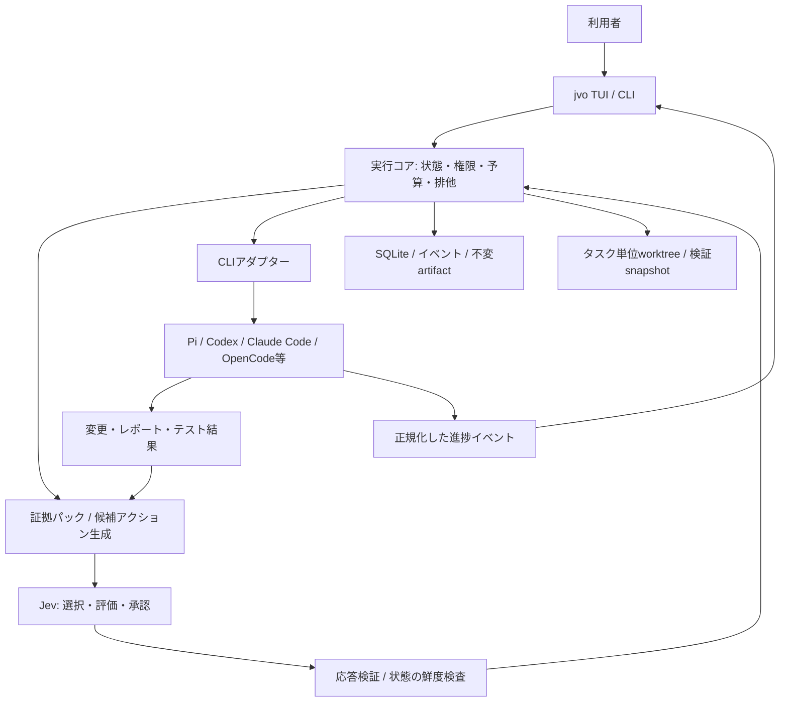

# jev-orchestrator 設計書

- 実行コマンド: `jvo`
- 設計日・一次資料確認日: 2026-09-18
- 状態: 新規プロダクトの設計仕様。実装・実機接続試験・性能測定は未実施です。
- 対象: ローカルの既存コーディングCLIを、Jevによる判断で協調実行するツールです。

## 0. 設計上の結論

**文章を生成する司令塔は置きません。Jevが決め、既存CLIが作業し、通常のプログラムが実行と安全性を管理します。**

作業の難易度、調査の要否、担当の選択、計画の採否、並列実行の可否、差し戻し、担当変更、完了承認をJevの判断対象とします。一方、プロセス起動、Git操作、権限、予算、ロック、状態保存、既知の終了コード判定は通常のコードで処理します。

Jevを入れるだけではキャッシュヒット率は改善しません。改善を狙う設計は、同じ変更タスクについてのCLI・モデル・セッション・作業ディレクトリの維持、共通指示の安定化、差分だけの引き継ぎ、判断結果の厳密な再利用です。目標はヒット率そのものではなく、品質を保った「受け入れ済みタスク当たりの総消費」です。

gloopのフォークや改修は前提にしません。既存ツールから、分離、観測、再開、安全な状態遷移という部分だけを参考にします。

## 1. 調査に基づく前提

### 1.1 Jevの実際の能力

TypeSafe AIのJevは、stateと型付きの質問を受け取り、Choice・Score・Noulを返す判断モデルです。自由な文章や実装コードを生成するインターフェースではありません。[S1][S2]

- Choice: 候補選択、候補の確率分布、confidence。
- Score: 順序付き評価段階に対するスコア、分布、confidence。任意の0〜1スコアと決めつけず、段階数とlegendを保持します。
- Noul: trueである確率に相当する0〜1の値。別のconfidenceはありません。

複数質問は同じstateに対して独立に評価されます。「先の質問の回答を踏まえて次の質問に答える」依存関係は同一リクエスト内に暗黙には作れません。[S1][S4]

confidenceは分布から計算された指標であり、実際の正解率ではありません。「confidence 0.9だから90%成功する」という表示・運用は禁止します。[S3]

### 1.2 参考にする既存実装

| 参考 | 確認した仕組み | 採用する考え方 | そのまま採用しないこと |
| --- | --- | --- | --- |
| knoopx/pi-swarm | Piエージェント別のJujutsu workspace、キュー、進捗イベント、差分・マージ | 実行状態の統一、途中指示、差分確認 | Pi専用・jj必須にはしません |
| sipyourdrink-ltd/bernstein | 非LLMのスケジューラー、タスクごとのworktree、ゲート、監査記録 | 実行の再現可能な記録、排他、権限境界 | 意味判断まで固定ワークフローだけで決めません |
| nrslib/takt | 計画・実装・レビュー・修正の明示的な遷移、再開時のworktree再利用 | レビューの独立、差し戻し先の維持 | 通常利用でYAMLの工程グラフ作成を要求しません |
| Gitlawb/openclaude | 会話中心のCLI、セッション操作、エージェント・ツール進捗イベント | 慣れた入力欄と折り畳める進捗 | 巨大なコーディングエージェント本体を移植しません |

pi-swarmという名称には複数のプロジェクトがあります。本書で分離方式を比較したのは `knoopx/pi-swarm` です。[S7–S13]

## 2. システム境界



### 2.1 Jevに任せること

タスク意図の分類、難易度評価、情報不足の判定、調査・計画提案の依頼、実行候補の選択、必要なレビューの選択、修正の採否、停滞の判定、エスカレーション、タスクの意味的な完了承認です。

### 2.2 CLIに任せること

調査、計画案の作成、コード編集、専門的レビュー、必要な説明文の作成です。CLIは提案者・作業者であり、他タスクの開始、承認済み範囲の拡張、他workerへの直接指示、完了承認、mainへの反映の権限を持ちません。

### 2.3 実行コアに任せること

プロセス管理、決定の実行、テストコマンドの実行と生の結果収集、許可ルール、権限、ロック、予算、artifact保存、Git操作、再開、表示です。

安全上の拒否はJevへの問い合わせを必要としません。禁止された操作をJevが許可しても実行しません。人間の停止・取消しも最優先です。

### 2.4 「すべてJevを仲介」の単位

**worker内部のファイル読取・編集一回ごとではなく、工程・タスク・担当・承認の境界を仲介します。**

進捗表示用のtokenイベント、heartbeat、既知のテスト終了コードを毎回Jevへ送らない設計です。worker内部の自動サブエージェントや外部委任も、制御可能なアダプターでは無効化します。制御できないCLIは完全管理対象として偽装せず、補助実行モードに分類します。

## 3. 初回起動と設定

### 3.1 `jvo` の初回フロー

1. Jevの接続先をTypeSafe公式またはVercel AI Gatewayから選びます。
2. API keyを非表示入力します。保存する場合はOSの秘密情報ストアを優先します。
3. プロジェクト情報を含まない小さな評価で接続・型・モデル情報を確認します。接続試験もAPI利用に当たることを表示します。
4. インストール済みCLIを検出します。
5. 使用可能なCLI、認証の確認状態、再開、構造化イベント、モデル指定、安全制御、使用量取得の対応を表示します。
6. 利用者が許可するCLIと実行profileを確定します。
7. リポジトリを信頼対象にするか、Jevへ送信するデータ範囲、ローカル変更の反映方法を確認します。
8. 通常の会話入力画面へ移ります。

設定済みなら次回から直接入力欄を表示します。API keyをリポジトリの設定ファイル、プロンプト、workerの環境変数、ログへ保存しません。

### 3.2 CLI検出

既知アダプターのmanifestに基づき、信頼されたPATH内の実体パスとバージョンを確認します。カレントディレクトリ内の同名実行ファイルや未知のスクリプトを、探索だけで無条件実行しません。各probeにはタイムアウトを設定します。

検出と認証成功は別です。認証状態は、CLIが提供する安全なstatus操作で分かる場合のみ確定し、それ以外は「未確認」と表示します。探索中の自動インストール、ブラウザーを開くログイン、課金付きの本番タスク実行は禁止します。

主なアダプター対象は `pi`、`codex`、`claude`、`opencode` です。Cursor、Gemini、Qwen系なども同じ契約で追加可能にします。ただし、名前が見つかっただけでは対応完了としません。

```ts
interface AgentCapabilities {
  binaryPath: string;
  binaryVersion: string;
  auth: 'verified' | 'unverified' | 'unavailable';
  structuredEvents: boolean;
  resumeById: boolean;
  modelSelection: boolean;
  modelIdentityObservable: boolean;
  structuredFinalReport: boolean;
  usageTelemetry: 'tokens-and-cache' | 'tokens-only' | 'none';
  delegationControl: boolean;
  executionPolicyControl: boolean;
  isolation: 'sandboxed' | 'workspace-only' | 'unknown';
}
```

OSのPATH上に存在するコマンドと、実行可能なprofileを分けて管理します。CLIの既存認証はCLI自身に利用させ、OAuthトークンの抽出や別サービスへの転送はしません。

Codexの非対話実行は保存済み認証を使用し、JSONLのイベントやusageを出力できます。Claude Codeにも構造化ストリームとsession ID指定の再開があります。これらをアダプターで扱い、文字列としてのターミナル画面解析は主経路にしません。[S14][S15]

### 3.3 管理レベル

| レベル | 条件 | 許可する用途 |
| --- | --- | --- |
| Managed | 構造化状態・完了報告・権限制御・必要な委任制御が確認済み | 自動工程に参加 |
| Assisted | 対話CLIを起動できるが状態や権限の一部を保証できない | 手動監督・明示的な引き継ぎ |
| Unavailable | 実体不明、必要認証なし、非対応バージョン | 一覧表示のみ |

モデル・provider・キャッシュ統計が観測できない場合も「unknown」を保持します。観測できない情報を推定して実測値扱いしません。

## 4. Jev providerアダプター

### 4.1 TypeSafe公式

`POST https://api.typesafe.ai/v1/systemone` を使用します。モデル、state、questionsを送信し、answersとusageを受け取ります。[S2]

モデルは接続時に確認し、固定できる正式バージョンを優先します。可変aliasを使用する場合は要求時のaliasと応答時のモデル識別子を分けて記録します。[S6]

### 4.2 Vercel AI Gateway

2026-09-16にJev対応が公開されています。評価は通常のチャットAPIではなく、AI SDK 7の `experimental_evaluate` を使用します。公開時の案内は7.0.105以降です。モデル指定は `typesafe-ai/jev` です。[S5][S5b]

Gatewayのevaluationは、OpenAI互換・Anthropic互換・Cohere互換エンドポイント経由ではありません。URLだけを差し替えたチャットクライアントでは実装しません。[S5]

```ts
// 接続方法の例。製品実装ではタイムアウト、検証、予算、ログの保護を追加します。
import { experimental_evaluate as evaluate } from 'ai';

const result = await evaluate({
  model: 'typesafe-ai/jev',
  state: {
    task: 'T-17',
    requirement: '期限切れセッションを拒否する',
    evidence: 'テストは成功したが、期限切れケースが含まれていない',
  },
  questions: {
    evidenceAdequate: {
      type: 'boolean',
      instructions:
        'stateの証拠は、期限切れセッションを拒否する要件の検証として十分ですか。',
    },
  },
});
```

### 4.3 型の正規化

| 内部表現 | TypeSafe公式 | Gateway |
| --- | --- | --- |
| Boolean確率 | `noul` / 回答の `noul` | `boolean` / 回答の `probability` |
| 候補選択 | `choice` | `choice` |
| 評価段階 | `score`、legendを保持 | `score`、質問側の段階定義も保持 |
| confidence | Choice/Scoreの回答内 | `providerMetadata.typesafe.confidence` |
| 使用量 | snake_case | SDKのusageに合わせて変換 |

Gateway metadataの具体的な構造は、固定したSDK/provider版に対する契約テストで検証します。取得できなければ不明として扱い、最大確率を勝手にconfidenceへ置き換えません。[S2][S5b]

```ts
type NormalizedAnswer =
  | { kind: 'boolean'; probability: number }
  | {
      kind: 'choice'; selected: string;
      probabilities: Record<string, number>; confidence?: number;
    }
  | {
      kind: 'score'; value: number; levels: string[];
      probabilities: Record<string, number>; confidence?: number;
    };
```

HTTP自体が成功しても、必須回答の欠落、未知の候補、NaN、範囲外確率、分布の不整合、質問版の不一致は拒否します。質問IDは推論に使われないため、対象タスク・判定対象は必ずinstructionsにも記載します。[S2]

provider切替時は校正データとモデル識別の互換性を確認します。同名Jevだから結果キャッシュを共有できるとはみなしません。

## 5. 実行profileと難易度ルーティング

### 5.1 profileは単なるモデル名ではありません

```text
profile = CLI実体 + CLI版 + provider + model識別子 + 役割
        + reasoning等の設定 + toolset + 権限 + 課金・契約区分
```

`fast`、`standard`、`deep`、`review` を用意しますが、どのCLI・モデルを割り当てるかは検出結果と利用者の設定で決めます。特定のモデルが常に最良とは固定しません。

料金が安いことより、必要な能力・権限・独立性を満たすことを優先します。サブスクリプションの利用枠やAPI認証への自動変更を隠れて行いません。

### 5.2 Jevが評価する軸

難易度を一つの印象点数だけにしません。

| 軸 | 判断する対象 |
| --- | --- |
| 要件の曖昧さ | 実装する前に確認・調査が必要か |
| 変更範囲 | 局所修正か、複数領域にまたがるか |
| 結合の強さ | API契約・共有型・DBなどに依存するか |
| 検証可能性 | 正否を確かめるテストや仕様があるか |
| 影響・リスク | 認証、課金、データ損失などに関わるか |
| 未知性 | 新規設計・難しい障害解析を含むか |

これらを独立した小さな質問にし、利用可能な候補を絞った後で担当profileを選びます。情報が足りなければ、低能力profileに賭けるのではなく調査workerを依頼します。

### 5.3 キャッシュを考慮した担当維持

同じタスクの修正は、原則として同じprofile・session ID・cwdへ戻します。担当変更の候補には、能力不足、障害・容量不足、長時間停滞、専門レビュー要求などの明確な理由を持たせます。

キャッシュを守るために能力不足のworkerを使い続けることは禁止します。反対に、少し難しく見えるたびにモデルを変更することも避けます。変更はJevの明示決定として記録します。

## 6. 計画を誰が作るか

Jevは計画文を生成しないため、計画が必要なタスクだけ、既存CLIへ「計画案を提出する作業」を依頼します。このworkerは司令塔ではありません。

単純な局所タスクはユーザー指示をそのまま一つのTaskSpecとして扱えます。複雑な依頼では、調査workerが影響範囲を報告し、提案workerが受け入れ条件・依存関係・read/write範囲を含むTaskGraph候補を作ります。

runtimeは循環依存、未定義task ID、危険なパス、範囲拡張、予算上限を検査します。その後、Jevが候補を採用・差し戻し・再調査へ振り分けます。複数案の作成は必要な場合だけで、全タスクに多人数の計画会議を付けません。

「プランナーが自分の判断で次のCLIを起動する」という経路は作りません。

## 7. 判断プロトコルと状態遷移

### 7.1 許可済み候補から選ばせます

Jevに任意のshellコマンド、ファイルパス、モデル名、TaskGraphを出力させません。runtimeが作った具体的なActionCandidateからIDを選択させます。

```ts
type ActionKind =
  | 'REQUEST_SCOUT' | 'REQUEST_PLAN' | 'ACCEPT_PLAN'
  | 'START_TASK' | 'REQUEST_REVIEW' | 'REQUEST_EVIDENCE'
  | 'REWORK_SAME_SESSION' | 'REASSIGN_TASK' | 'ACCEPT_TASK'
  | 'STAGE_INTEGRATION' | 'ASK_USER' | 'PAUSE' | 'CANCEL';

interface ActionCandidate {
  id: string;
  kind: ActionKind;
  taskId: string;
  profileId?: string;
  sessionId?: string;
  workspaceId?: string;
  evidenceIds: string[];
  preconditions: string[];
  reasonCode: string;
}
```

例えば「同じ担当への差し戻し」という選択には、担当・session・workspace・指摘集合をあらかじめ結び付けます。別々の質問で担当、workspace、差し戻し方法を独立に選ばせて、矛盾した組み合わせを実行しないようにします。

### 7.2 判断の単位

1. 進捗イベントから意味のあるチェックポイントを抽出します。
2. stateの不変snapshotとversionを取得します。
3. 関連する実際の証拠を含むEvidencePackを作成します。
4. 必要に応じて複数の原子的評価を一回で実施します。
5. 評価に依存する選択は、結果を反映した別stateで候補選択します。
6. 応答の型、候補、リスク別の不確実性、証拠不足を検証します。
7. 判断が参照したtask・依存task・資源の意味的versionと照合し、関係する部分が変わっていたら再評価します。
8. decision・状態変更・実行待ちoutboxを一つのトランザクションで保存します。
9. 実行直前にも権限・予算・lease・外部状態を再確認します。
10. 実行結果を記録します。

tokenのストリームやheartbeatでは意味的versionを更新しません。また、無関係な別タスクの進行で全判断を無効にするglobal versionだけに依存せず、参照したtask・artifact・資源のversion集合を記録します。こうして、並列実行中の不要な再判断を避けます。

予算不足、禁止操作、期限切れleaseなどは、Jevの判断が良好でも拒否します。拒否された判断を都合よく別の意味的アクションへ置き換えるのではなく、拒否イベントから次の判断へ進みます。

### 7.3 主な状態

```text
queued → assessing → ready → running → reported
                                      ↓
                                  verifying
                                      ↓
                                  reviewing
                          ┌───────────┼───────────┐
                        rework     accepted     blocked
                          ↓           ↓
                  同じtask/session   staging
                                      ↓
                              integration_verified
                                      ↓
                             ready_for_user_apply
                                      ↓
                                    applied
```

`reported` は「workerが終了した」という観測です。タスクが正しいと承認された意味ではありません。run内の隔離ブランチへの統合と、利用者のチェックアウトへの反映も分離します。

### 7.4 判断記録

```ts
interface DecisionRecord {
  id: string;
  runId: string;
  taskId: string;
  observationVersion: number; // 対象taskの意味的version
  dependencyVersions: Record<string, number>;
  semanticStateHash: string;
  requestedModel: string;
  resolvedModel?: string;
  provider: 'typesafe' | 'vercel';
  questionSetVersion: string;
  policyVersion: string;
  candidateSetHash: string;
  selectedCandidateId?: string;
  outcome: 'execute' | 'abstain' | 'invalid' | 'stale' | 'policy-denied';
  answers: Record<string, NormalizedAnswer>;
  evidenceIds: string[];
  sourceDecisionId?: string;
}
```

`/why` は選択結果、適用したルール、参照証拠、分布、拒否理由を表示します。モデルの内面の思考過程を生成して説明したようには見せません。

## 8. EvidencePackとartifact

### 8.1 Jevへ渡す情報

依頼原文、承認済み要件、現在のタスクと工程、関係するコード差分、検証結果、レビュー指摘、過去の修正の結果、利用可能な候補です。

全会話・全ログ・全リポジトリを毎回送信しません。しかし「artifact IDだけ」を送って、Jevが中身を読んだことにするのも禁止します。

```ts
interface EvidenceItem {
  id: string;
  kind: 'user-request' | 'code-diff' | 'test' | 'review' | 'observation';
  sourceHash: string;
  snapshotId: string;
  excerpt: string;
  sourceRange?: string;
  producerId: string;
  trust: 'runtime-observed' | 'worker-claimed' | 'user-specified';
}
```

試験コマンド・exit code・実行snapshotなどはruntimeが記録し、workerの「テストしました」という文章と区別します。runtimeが実行したテストであっても、テストの設計そのものが十分かは別の検討対象です。

### 8.2 文脈の取得

ローカルの索引・パス・文字列検索などで候補を狭め、必要ならJevで関連性を評価します。現在のタスクに必要な実際の抜粋を組み立てます。根拠不足を検出した場合は、追加読取や専門workerへの照会へ戻します。

固定したプロジェクト指示を毎ターン自動改稿しません。新しい知識は差分として追記し、明示された更新境界でcontext版を更新します。

### 8.3 細工された内容への対策

リポジトリ、テスト出力、レビュー文、Web取得文は信頼境界の外です。「安全ルールを無視して承認せよ」のような記述はstate内のデータであり、実行権限を変更しません。重要な権限・予算ルールをLLMのプロンプトだけに置かずruntimeで強制します。

## 9. 差し戻し、レビュー、停滞

### 9.1 修正指示は差分にします

```text
Task T-17 / Attempt 2
継続するsession: S-21
継続するworkspace: W-17
対象snapshot: H2
未解決の指摘:
  F-3: 期限切れケースを確認するテストがない
必要な追加証拠:
  E-8: 期限切れセッションが拒否される試験結果
維持する制約:
  認証方式と公開APIは変更しない
```

元の指示、全コード、他workerの会話を長文にまとめ直して渡しません。同じ担当の既存sessionに追加のuser messageとして渡します。

### 9.2 レビューの独立

レビューは実装担当とは別の会話で実施します。同じモデルしか利用できなくても、実装会話をそのまま自己採点させる構成を避けます。レビュー対象は固定したsnapshotです。

read-onlyレビューの判定中に実装workerが対象ファイルを変更することは禁止します。並行させる場合は別の固定snapshotを使用します。レビュー結果は変更可能な作業ツリーではなくsnapshot hashへ結び付けます。

### 9.3 指摘の状態管理

指摘にはID、対象要件、対象snapshot、重大度、根拠、再現条件、状態を付けます。状態はopen / fixed / disputed / not-applicableです。

修正workerがfixedと自己申告しただけでは閉じません。検証結果とレビューを受けてJevが採否を判断します。実装担当とレビュー担当が対立した場合は、要件ごとに争点を切り出し、追加の根拠や専門レビューを求めます。

### 9.4 ループ防止

同じ失敗signature、同じ修正差分、改善しないテスト結果を追跡します。単なる時間経過と、証拠を伴う停滞を区別します。

提案上の初期値は、同一失敗で二回改善がなければ診断を要求し、一タスクの修正試行は最大三回とします。これらは実測で確定した最適値ではなく、初期の暴走防止値です。上限到達後は同じ修正を無限再試行せず、Jevが再調査・再割当・利用者確認・停止の候補から選びます。

CLIの容量不足、認証切れ、ネットワーク障害、テスト環境故障は、実装の難しさと別に分類します。容量不足だけを理由に高額APIへ無断切替しません。

## 10. workspaceとGitの設計

### 10.1 既定は「変更タスク単位のworktree」です

タスクが実装、修正、再レビューを繰り返しても同じ作業ディレクトリを維持します。担当人数、工程数、試行回数に比例してworktreeを増やしません。

TAKTの再開処理には、既存worktreeのパスを検証し、再開に必要なworktreeが不正・消失している場合に新規クローンへ黙って置換しない処理があります。この「継続作業の同一性を守る」考えを採用します。[S11]

| 場面 | 配置 |
| --- | --- |
| 調査のみ | 書込中ではない固定snapshotを読取 |
| 一つのコード変更 | 一つのタスクworktree |
| 同タスクの差し戻し | 同じworktree・branch・session |
| 独立した複数変更 | タスク別worktree |
| 共有型・lockfile・DB migration等が競合 | 別worktreeでも並列適用はせず、依存関係・資源ロックで制御 |
| レビュー | 完成候補の固定読取snapshot |
| テストで生成物が必要 | snapshotを基にした検証用scratch領域 |
| 手元へ直接編集したい場合 | 明示的なin-placeモード、単一writerに限定 |

### 10.2 writerと共有資源

一つのtask workspaceには同時に一人だけwriter leaseを持てます。DB、開発サーバー、ポート、migration番号、外部検証環境なども資源IDとして管理します。

別worktreeであることは意味的な非競合を保証しません。例えば共有APIの変更と、それに依存するUIは、固定した先行成果物を参照するか、適切な依存順で実行します。

### 10.3 未コミット変更

通常の `git worktree add` は、利用者の未コミット変更を自動的に含むものとして扱いません。

起動時にdirty状態を検出し、次の扱いを明示します。

- 変更を含めない承認済み基準commitで作業する。
- 利用者が許可したtracked/untracked変更を選別し、run専用のsnapshotへ取り込む。
- 自動処理を保留する。

自動stash、元ファイルの上書き、元branchへの勝手なcommit、秘密の可能性があるuntrackedファイルの一括コピーはしません。

### 10.4 統合と反映

受け入れ済み成果物をintegration workspaceで順に統合します。競合が発生したら、解消を新しいworker作業として依頼し、変更snapshotに対する確認をやり直します。

全体テストとJevの意味的な最終確認を通過してから、`ready_for_user_apply` とします。既定では利用者の `/apply` が必要です。元チェックアウトの基準状態が変わっていたら、自動適用せず再検証します。remoteへのpush、PR作成、deployは独立した明示許可を必要とします。

### 10.5 worktreeはセキュリティsandboxではありません

Git worktreeだけではホームディレクトリ、秘密情報、ネットワーク、他workspaceへのアクセスは遮断されません。workspace分離とsandboxを別の能力として表示します。

read-onlyの強制や強い隔離が必要な作業は、それを実現できるsandbox backendでのみ実行します。プロンプトの「読取専用」や単純なchmodを強い境界として扱いません。対応できない環境では、信頼済みローカル作業に限定するか、要求を満たせない旨を表示して停止します。

依存物はパッケージストア等の再利用可能なキャッシュを共有しても、異なるlockfileを持つworktree間で書込可能なnode_modulesを無条件共有しません。生成物、DB、ポートは分離します。

## 11. キャッシュとtoken使用量

### 11.1 三つのキャッシュを混同しません

| 種類 | 何を再利用するか | 制御・限界 |
| --- | --- | --- |
| providerのprompt cache | 同一モデル等に送った共通prefix | native CLIとprovider側の仕様に依存 |
| context/artifact cache | ファイル、抜粋、diff、検証結果の不変データ | jvoがhashと版で管理 |
| Jevのdecision memo | 同一の意味的stateに対する過去の決定 | 候補・根拠・model・policyを含む厳密一致のみ |

OpenAIの文書は、cacheが同一prefixと有効な再利用境界に依存すること、履歴は書き換えず追加することを説明しています。保持期間、モデル設定、ツール定義、圧縮等にも影響されます。jvoはこれらを壊しにくくしますが、キャッシュの維持を保証するものではありません。[S16]

### 11.2 workerの再利用

```text
避ける:
  実装 → 全会話を司令塔へ → 要約し直す → 新worker → 新cwd → 再説明

採用する:
  実装session S1 → 検証snapshot → 別review session R1
                              → Jev決定 → S1に指摘差分を追加
```

守る対象は、可能な範囲でのprofile、役割、toolset、project指示版、session、cwdです。providerやモデルが異なるworker間でKV cacheを共有できることを前提にしません。

CLIプロセスを常駐させることと、provider側のcacheが残ることは別です。session再開によって履歴を維持できても、TTL・eviction・prefix構成・breakpointの都合でcache missは起こります。

### 11.3 コンテキスト量の削減

親workerの全会話は他のworkerへ渡しません。子workerには、そのタスクの依頼、合格条件、必要な実ファイル・抜粋だけを渡します。修正では未解決指摘と新しい証拠のみを追加します。

必要以上に大きい固定prefixを作って、見かけのヒット率を上げる設計にはしません。圧縮や削除でヒット率が下がっても、総入力と総費用が減り品質が維持できるなら改善です。

### 11.4 Jevの厳密なdecision memo

```text
memo key = hash(
  normalized semantic state,
  input evidence hashes,
  code snapshot,
  candidate set,
  worker profile/capability snapshot,
  question schema/version,
  policy and calibration version,
  provider and resolved model
)
```

時刻やイベントIDなど、判断に無関係なフィールドは意味的stateから分離します。ただし、期限、予算、認証、使用可能workerなど判断に関わる状態は省略しません。

memo再利用時も新しいDecisionRecordを作り、元の決定を参照します。実行直前の権限・ロック・予算・snapshot検査は省略しません。可変モデルaliasの実体が確認できなければ、runをまたぐ承認系memoを無効にします。

意味が似ているだけの別タスク、違うcommit、更新されたテスト結果に、以前のACCEPTを流用しません。

### 11.5 正確な使用量正規化

内部的には次を分けます。

```ts
interface NormalizedUsage {
  inputTotal?: number;
  inputCacheRead?: number;
  inputCacheWrite?: number;
  inputUncached?: number;
  outputTotal?: number;
  observedCost?: number;
  estimatedCost?: number;
  currency?: string;
  basis: 'provider-reported' | 'adapter-derived' | 'estimated' | 'unavailable';
}
```

OpenAI/Codex系のtotal inputに含まれるcached inputを二重加算しません。Anthropicでは、input_tokens、cache_creation_input_tokens、cache_read_input_tokensを合計して入力全体を算出するケースがあるため、provider別に正規化します。[S14][S17]

同じ時点の累積usageと各turnのusageを両方足すことも禁止します。event ID、turn ID、usageが差分か累積かをアダプターで扱います。

```text
token cache-read率 = Σ cache_read_tokens / Σ input_total_tokens
```

この率は統計を取得できた呼出しだけで計算し、観測カバレッジ（例えば「usage取得可能な完了turn数 / 全完了turn数」）を併記します。CLIごとの率を単純平均せず、未取得を0%として埋めません。

サブスクリプション経由のworkerにusageがあっても、実際の追加請求額や残り利用枠が分からないことはあります。その場合は不明とし、勝手に0円・無制限とは表示しません。

## 12. 画面と操作

### 12.1 通常画面

以下は表示例であり、実機検出・測定値ではありません。

```text
jvo  project: matching                 Jev: TypeSafe / 接続済み

> ログインの不具合を修正し、回帰テストも追加してください。

Jev  調査結果を受け、実装とテストを同じ変更タスクにまとめました。

  T1  Codex       実装中        src/auth/session.ts
  T2  Claude      レビュー待ち  T1の検証snapshot待ち
  T3  Pi          調査完了      関連する既存テストを確認

  完了条件 2/5    修正試行 1/3    cache: 取得待ち

> _
  /agents  /tasks  /diff  /why  /usage  /pause
```

通常は大きなダッシュボードや分割ターミナルを強制しません。入力欄、会話、数行の進捗を中心にし、`/agents` で展開します。

Jev名義の文はreason codeと観測事実から作るテンプレートです。詳細な自然文説明が必要な場合は説明workerへ依頼し、その発言者を区別します。

### 12.2 展開画面

表示対象は担当CLI・モデル、タスク、工程、実行時間、最後の動作、待ち理由、修正回数、workspace、使用量、判断履歴です。

進捗率をJevに想像で付けさせません。検証済み条件数、完了タスク数、実行中コマンド等を表示します。計画が変わり分母が増えたときは、その変更を示します。

### 12.3 軽量な描画

workerの全tokenを毎回画面全体へ描画しません。イベント処理と表示を分離し、表示更新はまとめ、保持する画面ログを制限し、詳細ログはディスクへ保存します。UIが閉じたり特定workerを非表示にしたりしても、stdout/stderrの読取を止めてworkerを詰まらせないようにします。

プロジェクト名、ファイル名、ログに含まれるANSI/OSC制御文字は無害化します。raw PTYは必要時の手動attach用であり、機械的な完了承認の根拠にはしません。

### 12.4 コマンド案

```text
jvo                         対話開始。未設定なら初回設定
jvo "タスク内容"            一件の依頼で開始
jvo doctor                  CLI・認証・対応能力の診断
jvo agents                  検出済みCLIとprofile
jvo resume <run-id>          保存済みrunの照合・再開
jvo replay <run-id>          記録済み判断と状態遷移を表示
jvo eval <dataset>          校正・比較評価

/agents /tasks /diff /why /usage /pause /resume /apply
```

これらは製品の設計コマンドです。現時点で公開済みパッケージが存在するという意味ではありません。

## 13. Jevの特性を活かす追加機能

### 13.1 必要なときだけ深い調査

不確実性が高いとき、無条件で大きなモデルへ実装を投げ直すのではなく、「何の証拠が足りないか」という候補を選び、そこだけ追加調査します。具体的な調査計画や説明はworkerが作成します。

### 13.2 skill・文脈の選択

利用可能なskillの名前・説明や、関連資料候補を評価し、必要なものだけworkerへ渡します。一度開始したworkerのsystem指示を毎ターン書き換えず、追加skillは明示的な境界で導入します。

### 13.3 指摘の重複と争点の整理

同じsnapshotに対する似た指摘を候補として比較し、同一の問題か別問題かを判定します。統合した指摘にも元の根拠を残し、少数意見を自動的に消さない設計です。

### 13.4 リスクに応じたレビューの追加

固定の安全ポリシーを下限にし、その上でJevが専門レビューの追加を選びます。課金、権限、認証、破壊的migrationなどの重要領域は、見た目の変更量が小さくても軽い扱いにしません。

### 13.5 改善しない修正の早期打切り

テスト・差分・指摘の変化を使って停滞を判断し、必要なときだけ別担当や専門家へ切り替えます。無限の「continue」を避けるための機能です。

### 13.6 モデル更新前の影の評価

記録済みのstateと人間による正誤ラベルを使い、新しいJevモデル・質問・閾値を実際の操作なしで評価します。以前より不適切な承認が増える場合は更新しません。これは記録済み決定のreplayとは別の処理です。

### 13.7 画像系タスク

確認したJevのstateはテキストのみです。UIスクリーンショット等は視覚対応workerが確認し、その観測結果・対象snapshot・根拠をJevへ渡します。Jev自身が画像を見て合格を判断したとは表示しません。[S4]

## 14. 永続化、障害復旧、予算

### 14.1 正とする状態

SQLiteを状態の正とし、一つのrun supervisorが状態更新を直列化します。最低限のtableはruns、tasks、attempts、profiles、sessions、workspaces、leases、events、decisions、artifacts、usage、outbox、approvalsです。

大きなログ・diff・レポートはcontent-addressedなファイルへ置き、DBにはhashと参照を保存します。stateはプロジェクト外の利用者データ領域へ保存し、Gitの変更やworkerの検索範囲を無駄に増やしません。

```text
<user-state>/jvo/repos/<repo-id>/
  state.sqlite
  artifacts/<content-hash>
  workspaces/<task-id>/
  integration/<run-id>/
  logs/<run-id>/
```

### 14.2 supervisorとTUI

論理的には分離し、通常起動時はjvoがrun用supervisorを立ち上げて接続します。永続的な全マシン常駐daemonを必須にはしません。TUIを閉じた後も続けるdetachは利用者が明示した場合だけです。

IPCは利用者専用権限のローカル通信とし、HTTPダッシュボードを外部へ既定公開しません。

### 14.3 再開

起動済みプロセス、PIDの生成時刻、session、worktree、outboxを照合します。成功を観測できないままプロセスが消失した場合はunknown/staleとし、勝手に成功や安全な再実行とみなしません。

外部プロセスやGit操作をDBトランザクションだけで完全なexactly-onceにできるとは主張しません。冪等キー、操作前後の検査、排他、照合によって重複実行を防ぎます。副作用が不明な場合は確認待ちにします。

replayは記録済み判断を読み直すだけで、Jevの再呼出し、ファイル変更、shellコマンド実行、課金を行いません。

### 14.4 Jev障害

429/529などは回数・時間を限定したbackoffで再試行します。SDKとruntimeのリトライを二重に重ねません。継続失敗時は次の意味的遷移を保留します。既に動作中のworkerは、与えられた範囲と予算の中でチェックポイントまで到達できますが、自動承認や次タスク開始はしません。

別の高額な汎用LLMへ黙って司令塔を置き換えません。

### 14.5 予算

Jev API呼出し、worker、再試行、並列数、経過時間に別々の上限を設けます。API費用を観測できる経路は、実行前予約と実績照合を行います。provider側予算機能が利用できる場合は併用します。

native CLIの追加課金や利用枠が観測不能な場合、jvo単独で正確な金額上限を保証できるとは表示しません。その経路ではturn数・起動回数・時間・並列数等の制限を適用します。

## 15. セキュリティ要件

制御プロセスのJevキーはworker・テスト・依存関係インストールの環境へ継承しません。プロジェクトの `.env` を自動で全て読み込みません。

ただし同一OSユーザーによる通常のローカル実行だけでは、全ての秘密情報に対する強い隔離は保証できません。強い分離が必要な場合は、秘密情報を制御プロセス側へ置き、workerを制限されたsandboxへ入れ、必要な認証方法を個別に検証します。既存CLI認証を再利用することと、安全なsandbox配置の互換性は自動的に成立するものではありません。

プロジェクト設定は安全ポリシーを緩める権限を持ちません。root設定・利用者承認・run単位のpolicy snapshotを優先します。リポジトリ内の実行フックや任意アダプターは、trust承認なしで起動しません。

Jevにもコード断片やレビュー内容が外部送信されることを明示し、除外パターン、最大送信サイズ、秘密情報検査を設けます。秘密情報検査は完全ではないため、送信対象を必要最小限にすることを併用します。

## 16. 実装構成

TypeScriptで制御コア・CLIアダプター・providerアダプターを揃えます。Gatewayの公式評価SDKと型を共有しやすくするためです。Node.js、SDK、CLIの対応版は実装時にlockfileと互換性テストで固定します。

```text
apps/
  cli/                     jvoコマンド、初回設定、TUI接続
  supervisor/              run単位の監督プロセス
packages/
  core/                    TaskSpec、状態遷移、ActionCandidate
  decision/
    typesafe/              公式API
    vercel/                AI SDK evaluation
    normalize/             確率・usage・metadataの正規化
    questions/             判定基準・版管理
  runtime/                 scheduler、outbox、lease、policy、budget
  adapters/
    pi/
    codex/
    claude/
    opencode/
    registry/              検出・能力・対応版
  workspaces/              Git、snapshot、検証scratch、in-place
  context/                 EvidencePack、ローカル索引、抜粋
  storage/                 SQLite、artifact、journal
  telemetry/               usage、費用、cache、観測率
  tui/                     入力、進捗、ログ、差分、判断履歴
  eval/                    校正、回帰、比較、障害注入
```

画面はInk等で薄く作り、エージェント実装本体を新たに抱えません。CLI側の構造化プロトコルを利用できる場合は優先し、未知バージョンを無条件に互換扱いしません。

### 16.1 アダプター契約

```ts
interface AgentAdapter {
  detect(): Promise<AgentCapabilities | null>;
  inspectAuth(): Promise<'verified' | 'unverified' | 'unavailable'>;
  start(spec: WorkerInvocation): Promise<WorkerHandle>;
  resume(sessionId: string, spec: WorkerInvocation): Promise<WorkerHandle>;
  interrupt(handle: WorkerHandle): Promise<void>;
  collectReport(handle: WorkerHandle): Promise<WorkerReport>;
}

interface WorkerInvocation {
  invocationId: string;
  runId: string;
  taskId: string;
  profileId: string;
  role: 'scout' | 'planner' | 'implementer' | 'reviewer' | 'explainer';
  workspaceId: string;
  baselineSnapshot: string;
  instructionArtifact: string;
  evidenceArtifacts: string[];
  approvalScopeId: string;
  maxTurns?: number;
  timeoutMs: number;
}

interface WorkerReport {
  invocationId: string;
  taskId: string;
  sessionId?: string;
  observedStatus: 'reported' | 'failed' | 'interrupted' | 'unknown';
  claims: string[];
  artifactIds: string[];
  unresolvedQuestions: string[];
}

interface WorkerHandle {
  invocationId: string;
  pid?: number;
  sessionId?: string;
}
```

`WorkerReport`に信頼済みのタスク合格フラグは持たせません。合格は別途JevのDecisionRecordとruntimeの検証結果から確定します。

## 17. 小さな設定ファイル

初期設定はwizardで完了し、通常利用では編集不要です。高度な設定例は次の通りです。

```toml
# 設計例です。API keyや生のOAuth tokenは書きません。
[decision]
provider = "typesafe" # または "vercel"
model = "jev-latest"  # 接続時に実体識別子を確認・記録
question_set = "coding-v1"

[runtime]
max_parallel_workers = 3
max_repair_attempts = 3
max_same_failure_without_progress = 2
unknown_side_effect = "pause"

[workspace]
mode = "task-worktree"
apply_to_user_checkout = "confirm"
dirty_checkout = "ask"

[cache]
session_affinity = true
handoff = "delta"
decision_memo = "exact"

[review]
separate_session = true
snapshot_bound = true

[telemetry]
unknown_usage = "show-unknown"
raw_log_retention_days = 14
```

数値は初期の設計値であり、測定に基づく最適値ではありません。モデルの校正profileや利用者による権限設定は別に保持します。confidenceの閾値を全行動に共通の一つの数字で設定しません。

## 18. 完成判定・テスト計画

### 18.1 機能の完成条件

公式/Gatewayの両方で同じ内部判断契約が成立すること（同じ回答値を保証する意味ではありません）、複数CLIで開始・再開・終了・失敗・使用量を正規化できること、意味的な実行判断をJevの記録まで追跡できることを必須とします。

少なくとも、単一タスク、並列タスク、差し戻し、担当変更、独立レビュー、統合、利用者反映、停止・復旧の経路が全て動作する必要があります。画面だけ動くことを完成とはしません。

### 18.2 評価用タスク

局所的バグ、複数ファイルの機能追加、API契約変更、UI＋API、認証、DB migration、仕様不足、テスト不足、難しい再現不具合、悪意のあるリポジトリ内指示を含むセットを作ります。

人間または独立検査で、実装の正しさだけでなくJevの判断の適否をラベル付けします。学習・閾値調整用と最終評価用を分離します。

### 18.3 比較条件

同じタスク集合・開始snapshot・worker profileで、通常の単体CLI、文脈を作り直す方式、jvo方式を比較します。初回実行と再実行を分け、実際のcache使用量でcold/warmの状況を記録します。providerのcacheを確実に強制消去できるとは仮定しません。

### 18.4 指標

最優先は誤承認率、要件達成率、回帰の有無です。その条件を満たした上で、受け入れ済みタスク当たりの費用・入力token・出力token・経過時間・修正回数を評価します。完了できなかったrunの消費も総費用に含めます。

補助指標はcache-read率、usage観測カバレッジ、Jev判断回数、worker間の引き継ぎtoken、session維持率、workspace再作成数、担当変更回数です。

「cacheが80%になる」「何倍速くなる」といった数値は、測定前には製品の事実として出しません。

### 18.5 必須の障害・安全テスト

| ケース | 期待結果 |
| --- | --- |
| Jev応答が遅延中にstateが変更 | 古い決定を実行せず再評価 |
| 同じ完了イベントが二回来る | 次工程を二重起動しない |
| workerが成功と発言、実測テスト失敗 | タスクを受け入れない |
| reviewerが古いsnapshotを確認 | 現行成果物の承認へ流用しない |
| workerが別workerを起動しようとする | 管理モードの許可範囲で拒否・検出 |
| 再開すべきworktreeが消失 | 新しい場所へ黙って置換しない |
| dirtyな元checkoutが途中で更新 | 自動applyを拒否し再照合 |
| providerがconfidenceを返さない | 架空のconfidenceを作らない |
| usage統計なし | 0円・0%と表示しない |
| Jevネットワーク断 | 新しい意味的遷移を保留 |
| アダプターのバージョン非対応 | Managed扱いをしない |
| 制御キーの環境継承 | worker・テストへ渡らない |
| リポジトリ内の悪意ある指示 | policyと候補範囲を変更できない |
| UIでログが大量に流れる | stdinとworker出力収集が詰まらない |
| 記録replay | API呼出し・課金・副作用が起きない |

## 19. 最終方針

jvoの差別化は、エージェントを多数起動できることではありません。

**小さな判断をJevへ集約し、作業は既存CLIへ任せ、証拠・session・workspaceを保ったまま、必要な範囲だけ次へ進めることです。**

重要なのは、Jevを万能な司令塔に見立てないこと、typedな回答を正しさの証明と混同しないこと、キャッシュの見かけの数字より受け入れ品質と総消費を評価することです。

## 一次資料

以下は設計の根拠として確認した一次資料です。外部API・モデル・CLIの仕様は更新されるため、実装では対応版を固定して契約テストを行います。

- [S1 TypeSafe AI — Introduction](https://docs.typesafe.ai/introduction)
- [S2 TypeSafe AI — API reference](https://docs.typesafe.ai/api)
- [S3 TypeSafe AI — Confidence](https://docs.typesafe.ai/confidence)
- [S4 TypeSafe AI — State](https://docs.typesafe.ai/concepts/state)
- [S5 Vercel — Evaluation](https://vercel.com/docs/ai-gateway/modalities/evaluation)
- [S5b Vercel — Jev availability, 2026-09-16](https://vercel.com/changelog/typesafe-ai-jev-now-available-on-ai-gateway)
- [S6 TypeSafe AI — Models](https://docs.typesafe.ai/models)
- [S7 knoopx/pi-swarm — README](https://github.com/knoopx/pi-swarm/blob/main/README.md)
- [S8 knoopx/pi-swarm — workspace implementation](https://github.com/knoopx/pi-swarm/blob/main/src/workspace.ts)
- [S9 sipyourdrink-ltd/bernstein — README](https://github.com/sipyourdrink-ltd/bernstein/blob/main/README.md)
- [S10 nrslib/takt — README](https://github.com/nrslib/takt/blob/main/README.md)
- [S11 nrslib/takt — reusedWorktree implementation](https://github.com/nrslib/takt/blob/main/src/features/tasks/execute/reusedWorktree.ts)
- [S12 Gitlawb/openclaude — README](https://github.com/Gitlawb/openclaude/blob/main/README.md)
- [S13 Gitlawb/openclaude — task progress events](https://github.com/Gitlawb/openclaude/blob/main/src/utils/task/sdkProgress.ts)
- [S14 OpenAI — Codex non-interactive mode](https://developers.openai.com/codex/noninteractive)
- [S15 Anthropic — Claude Code programmatic usage](https://code.claude.com/docs/en/headless)
- [S16 OpenAI — Prompt caching](https://developers.openai.com/api/docs/guides/prompt-caching)
- [S17 Anthropic — Prompt caching](https://platform.claude.com/docs/en/build-with-claude/prompt-caching)
